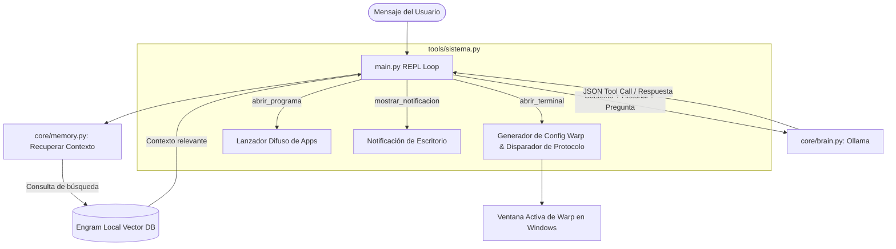

# 🤖 Viernes Pilot

[](#) 
[](README.md)

> **Viernes Pilot** es un asistente de desarrollo y orquestador de espacios de trabajo local y enfocado en la privacidad. Potenciado por **Ollama** (Qwen) y **Engram** (memoria a largo plazo), integra WSL (Ubuntu) con el sistema operativo anfitrión Windows para automatizar la configuración de entornos, lanzar herramientas mediante búsqueda difusa (fuzzy matching) y orquestar layouts en **Warp Terminal** de manera programática.

---

### 🌐 [🇺🇸 Read in English (Versión en Inglés)](README.md)

---

## 🚀 Características Clave

- 🧠 **Memoria Vectorial a Largo Plazo (RAG)**: Integración nativa con [Engram](https://github.com/) para almacenar y recuperar recuerdos, preferencias de desarrollo y contextos de configuración de tus proyectos a lo largo del tiempo.
- 🌀 **Orquestador para Warp Terminal**: Genera de forma dinámica archivos de configuración TOML en Windows AppData/WSL y abre nuevas pestañas interactivas en tu terminal Warp a través del protocolo `warp://`.
- ⚡ **Lanzador de Aplicaciones Inteligente**: Abre aplicaciones del sistema de manera segura (utilizando normalizadores de texto y scoring híbrido de coincidencia) libre de riesgos de inyección de comandos.
- 🖥️ **Puente WSL ⇄ Windows**: Traducción automática de rutas (rutas absolutas de WSL $\leftrightarrow$ rutas UNC de Windows a través de `wslpath`) y resolución dinámica de perfiles de usuario.
- 💬 **Interfaz CLI Interactiva (REPL)**: Consola de chat rápida y conversacional con soporte nativo de llamadas a funciones (tool calling).

---

## 📐 Arquitectura y Flujo de Trabajo



---

## 🛠️ Stack y Requisitos Previos

| Componente | Tecnología | Por Defecto |
|---|---|---|
| **LLM** | Ollama | `qwen3.5:9b` (Soporte nativo para Tool Calling) |
| **Embeddings** | Ollama | `nomic-embed-text` |
| **Memoria** | Engram | Base de datos vectorial local en puerto `7437` |
| **Lenguaje** | Python | `3.12+` |
| **Terminal** | Warp Terminal | Layouts de configuración y orquestación de pestañas |

---

## 📦 Instalación y Configuración

### 1. Configuración de Servicios Locales

Asegúrate de tener **Ollama** y **Engram** corriendo en tu máquina local.

```bash
# Descarga los modelos necesarios en Ollama
ollama pull qwen3.5:9b
ollama pull nomic-embed-text
```

### 2. Configurar el Repositorio

Clona el proyecto y configura tu entorno virtual:

```bash
# Clona el repositorio
git clone https://github.com/ifmlinares/viernes-pilot.git
cd viernes-pilot

# Crea y activa el entorno virtual de Python
python3 -m venv .venv
source .venv/bin/activate

# Instala las dependencias
pip install -r requirements.txt
```

### 3. Verificar la Conectividad

Ejecuta los tests unitarios y de integración para asegurar que todo se conecta correctamente con Ollama, Engram y las rutas del sistema:

```bash
# Ejecuta los tests unitarios
python3 -m unittest discover -s tests
```

---

## 🚀 Uso de Viernes Pilot

Para iniciar la interfaz interactiva (CLI):

```bash
python3 main.py
```

### Ejemplos de Interacción:

* **Configuración del Espacio de Trabajo**: 
  > *"Abre el entorno de hola bus"*
  
  *(Viernes abrirá automáticamente la carpeta del proyecto en tu IDE y creará una nueva pestaña interactiva en Warp ejecutando el servidor de desarrollo en primer plano).*

* **Lanzamiento de Programas (Fuzzy)**:
  > *"Abre la calcualdora"*
  
  *(Resuelve la coincidencia y lanza la Calculadora de Windows).*

* **Persistencia en Memoria**:
  > *"Recordá que mi puerto de desarrollo principal es el 8000"*  
  > ... (En la próxima sesión) ...  
  > *"¿En qué puerto levanto los proyectos?"*

---

## 📁 Estructura del Repositorio

```
viernes-pilot/
├── config.py           # Modelos, prompts del sistema y puertos de servidores.
├── main.py             # Loop REPL de terminal y enrutador de herramientas.
├── core/
│   ├── brain.py        # Cliente de la API de Ollama (Chat & Embeddings).
│   └── memory.py       # Cliente de la API de Engram (CRUD de memoria y expansión).
├── tools/
│   └── sistema.py      # Búsqueda difusa de apps, configs de Warp y utilidades de SO.
├── tests/
│   ├── test_conectividad.py   # Pruebas de conectividad con servicios locales.
│   └── test_sistema.py        # Pruebas de normalización y traducción de rutas WSL.
└── .gitignore          # Reglas avanzadas de exclusión de Git.
```

## ⚖️ Licencia

Distribuido bajo la Licencia MIT. Consulta `LICENSE` para más información.
