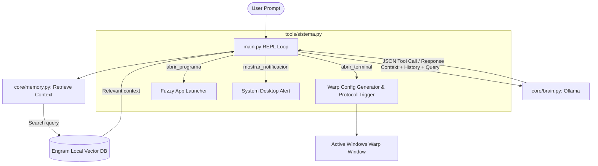

# 🤖 Viernes Pilot

[](#) 
[](README.es.md)

> **Viernes Pilot** is a local, privacy-first developer assistant and workspace orchestrator. Powered by **Ollama** (Qwen) and **Engram** (long-term memory), it integrates WSL (Ubuntu) with Windows to automate environment setups, launch tools using fuzzy matching, and programmatically orchestrate **Warp Terminal** layouts.

---

### 🌐 [🇪🇸 Leer en Español (Spanish Version)](README.es.md)

---

## 🚀 Key Features

- 🧠 **Long-Term Vector Memory (RAG)**: Integrates with [Engram](https://github.com/) to save and retrieve memories, preferences, and project configuration context over time.
- 🌀 **Warp Terminal Orchestrator**: Generates dynamic TOML configurations inside Windows AppData/WSL and executes interactive foreground terminal tabs for your projects via the `warp://` URI protocol.
- ⚡ **Fuzzy App Launcher**: Safely opens system applications (using custom normalizers and hybrid matching scoring) without exposing the shell to command injection vulnerabilities.
- 🖥️ **WSL ⇄ Windows Bridge**: Automatic file path translation (WSL absolute paths $\leftrightarrow$ Windows UNC paths) and dynamic user profile resolution.
- 💬 **Interactive CLI REPL**: A responsive command-line interface with native tool-calling capabilities.

---

## 📐 Architecture & Workflow



---

## 🛠️ Stack & Prerequisites

| Component | Technology | Default |
|---|---|---|
| **LLM** | Ollama | `qwen3.5:9b` (Native tool calling support) |
| **Embeddings** | Ollama | `nomic-embed-text` |
| **Memory** | Engram | Local Vector DB on port `7437` |
| **Language** | Python | `3.12+` |
| **Terminal** | Warp Terminal | Native config layout & tab orchestration |

---

## 📦 Installation & Setup

### 1. Configure Local Services

Make sure **Ollama** and **Engram** are running locally.

```bash
# Pull the required models in Ollama
ollama pull qwen3.5:9b
ollama pull nomic-embed-text
```

### 2. Set Up the Repository

Clone the project and create a virtual environment:

```bash
# Clone the repository
git clone https://github.com/ifmlinares/viernes-pilot.git
cd viernes-pilot

# Create and activate virtual environment
python3 -m venv .venv
source .venv/bin/activate

# Install dependencies
pip install -r requirements.txt
```

### 3. Verify the Connectivity

Run unit and integration tests to ensure that the system successfully links with Ollama, Engram, and system paths:

```bash
# Run connection & logic tests
python3 -m unittest discover -s tests
```

---

## 🚀 Running Viernes Pilot

To start the interactive CLI:

```bash
python3 main.py
```

### Example Commands:

* **Workspace Setup**: 
  > *"Abre el entorno de hola bus"*
  
  *(Viernes will automatically open the project directory in your IDE and spawn a new active tab in Warp Terminal running the dev server).*

* **Fuzzy App Launching**:
  > *"Abre la calcualdora"*
  
  *(Launches Windows Calculator using fuzzy matched scoring index).*

* **Memory Recall**:
  > *"Recordá que mi puerto de desarrollo principal es el 8000"*  
  > ... (Next session) ...  
  > *"¿En qué puerto levanto los proyectos?"*

---

## 📁 Repository Structure

```
viernes-pilot/
├── config.py           # Model configs, prompts, and server ports.
├── main.py             # CLI REPL loop & tool call router.
├── core/
│   ├── brain.py        # Ollama API client (Chat & Embeddings).
│   └── memory.py       # Engram API client (Memory CRUD & Keyword expansions).
├── tools/
│   └── sistema.py      # Fuzzy application matching, Warp configurations, and OS utilities.
├── tests/
│   ├── test_conectividad.py   # Connectivity tests with local servers.
│   └── test_sistema.py        # Normalization and WSL path translation tests.
└── .gitignore          # Extended git safety patterns.
```

## ⚖️ License

Distributed under the MIT License. See `LICENSE` for more information.
